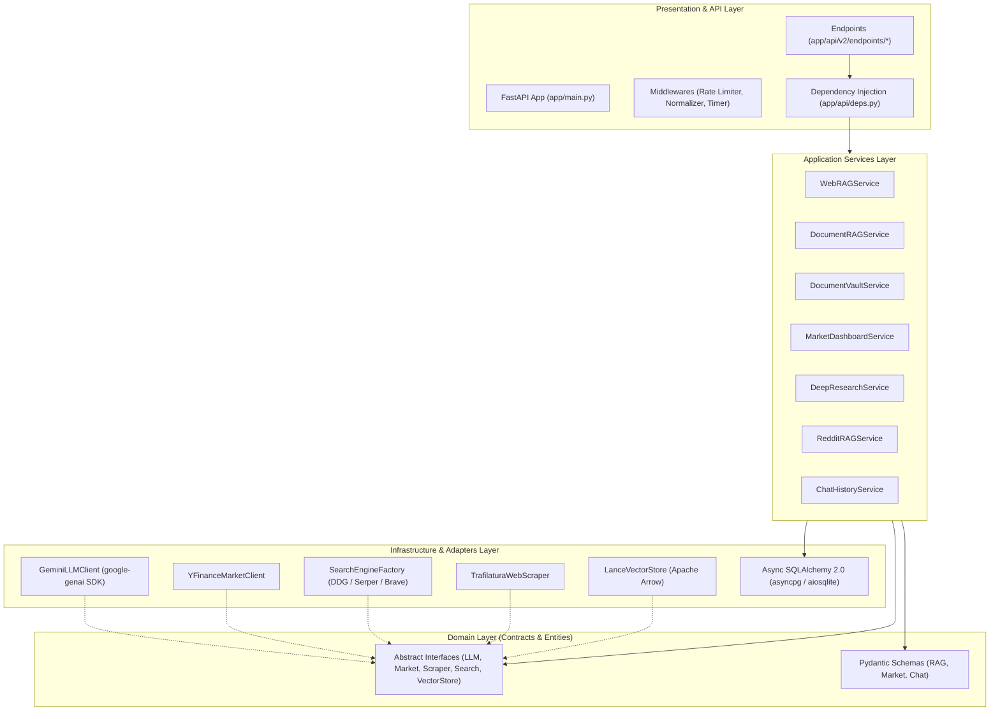
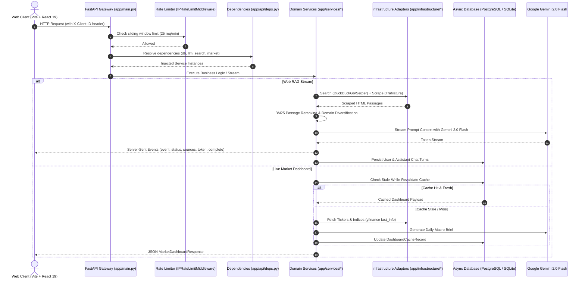
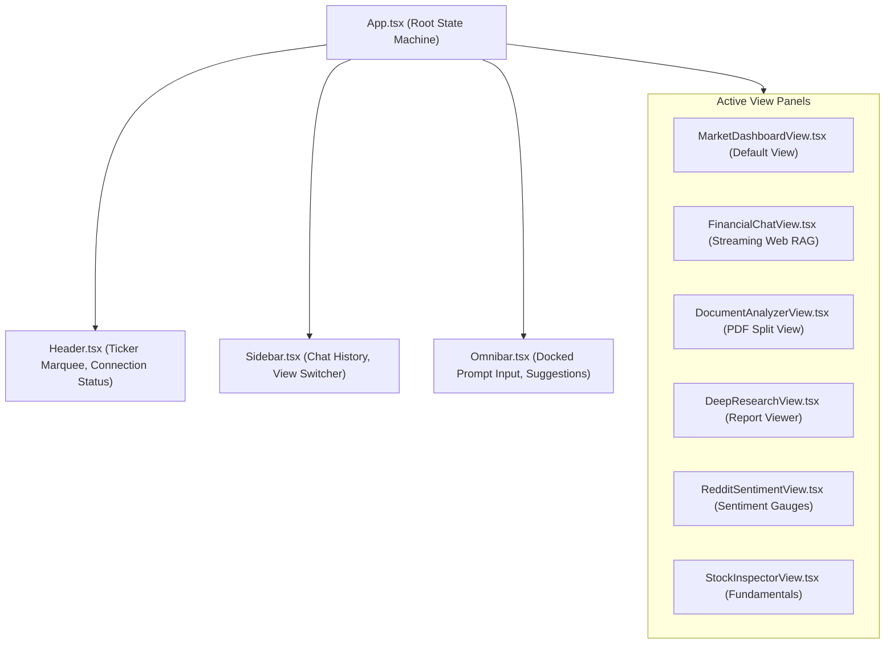

# MarketMind Developer Architecture & Navigation Guide

Welcome to the **MarketMind** codebase. This guide is written for engineers who need to understand the architecture, navigate the code, trace execution paths, find key methods, and safely implement new features or modifications.

---

## 📑 Table of Contents

1. [Architectural Overview & Core Principles](#1-architectural-overview--core-principles)
2. [End-to-End System Topology](#2-end-to-end-system-topology)
3. [Repository Directory Map](#3-repository-directory-map)
4. [Subsystem Architecture & Connections](#4-subsystem-architecture--connections)
   - [4.1 Configuration & Environment Settings](#41-configuration--environment-settings)
   - [4.2 Database & Persistence Layer](#42-database--persistence-layer)
   - [4.3 Security & Sliding-Window Rate Limiting](#43-security--sliding-window-rate-limiting)
   - [4.4 Dependency Injection (`deps.py`)](#44-dependency-injection-depspy)
   - [4.5 Streaming Web RAG Pipeline](#45-streaming-web-rag-pipeline)
   - [4.6 Multimodal Document RAG Service](#46-multimodal-document-rag-service)
   - [4.7 Historical Filings Document Vault (LanceDB)](#47-historical-filings-document-vault-lancedb)
   - [4.8 Market Data & SWR Dashboard Subsystem](#48-market-data--swr-dashboard-subsystem)
   - [4.9 Deep Equity Research Engine & PDF Export](#49-deep-equity-research-engine--pdf-export)
   - [4.10 Retail Community Sentiment Engine](#410-retail-community-sentiment-engine)
   - [4.11 Anonymous Chat Session Management](#411-anonymous-chat-session-management)
5. [Frontend Web Terminal Architecture](#5-frontend-web-terminal-architecture)
   - [5.1 Component Structure & State Flow](#51-component-structure--state-flow)
   - [5.2 API Client & SSE Streaming Hook](#52-api-client--sse-streaming-hook)
6. [How to Trace Execution Paths](#6-how-to-trace-execution-paths)
   - [Trace A: Streaming Web RAG Query](#trace-a-streaming-web-rag-query)
   - [Trace B: Real-Time Stock Quote Request](#trace-b-real-time-stock-quote-request)
   - [Trace C: Deep Equity Research & PDF Export](#trace-c-deep-equity-research--pdf-export)
   - [Trace D: Document Vault Ingestion & Query](#trace-d-document-vault-ingestion--query)
7. [Developer How-To Guides](#7-developer-how-to-guides)
   - [How to Add a New API Endpoint](#how-to-add-a-new-api-endpoint)
   - [How to Add or Switch a Search Engine Provider](#how-to-add-or-switch-a-search-engine-provider)
   - [How to Add a New Financial Metric / Ratio](#how-to-add-a-new-financial-metric--ratio)
   - [How to Add a New Server-Sent Event (SSE) Type](#how-to-add-a-new-server-sent-event-sse-type)
   - [How to Add a New Database Model](#how-to-add-a-new-database-model)
8. [Testing & Quality Assurance](#8-testing--quality-assurance)
9. [Production Deployment & Containerization](#9-production-deployment--containerization)

---

## 1. Architectural Overview & Core Principles

MarketMind is structured around **Clean Architecture** and **SOLID design principles**, organized into four decoupled concentric layers:



### Core Principles

1. **Dependency Inversion**: High-level application services never import low-level adapters directly. They depend on abstract base classes defined in `app/domain/interfaces/`. Adapters in `app/infrastructure/` implement these interfaces.
2. **Zero Import Side-Effects**: Importing `app.core.config` or any module never triggers network calls, database queries, model downloads, or external API checks. Everything is initialized lazily or during the FastAPI `lifespan` context.
3. **Strict 512 MB RAM Footprint**: The application is engineered to operate on resource-constrained free cloud tiers (Render, Koyeb). It enforces single-threaded numerical execution (`OPENBLAS_NUM_THREADS=1`, `MKL_NUM_THREADS=1`, `OMP_NUM_THREADS=1`), avoids heavy neural PyTorch models in production, and uses in-process columnar vector storage via Apache Arrow (LanceDB).
4. **Resilient Provider Fallbacks**: Every external integration (Search, Market Data, Database) contains automatic, transparent fallback handling (e.g., DuckDuckGo fallback, Yahoo Finance crumb-free fast_info fallback, and automatic local SQLite fallback if PostgreSQL is unavailable).

---

## 2. End-to-End System Topology



---

## 3. Repository Directory Map

Here is the exact structural organization of the repository:

```
MarketMind-API/
├── app/                              # Backend Application Package (Clean Architecture)
│   ├── api/                          # HTTP Presentation & Delivery Layer
│   │   ├── deps.py                   # Central Dependency Injection providers (FastAPI Depends)
│   │   └── v2/                       # API Version 2
│   │       ├── router.py             # Master router mounting all v2 endpoint modules
│   │       └── endpoints/            # Domain-specific route controllers
│   │           ├── chat.py           # Anonymous chat session retrieval & deletion
│   │           ├── dashboard.py      # Live market indices, gainers/losers, AI brief
│   │           ├── health.py         # Healthcheck and dynamic rate limit configuration
│   │           ├── rag.py            # Streaming Web RAG, PDF multimodal RAG, Reddit sentiment
│   │           ├── research.py       # 7-section deep equity research & ReportLab PDF export
│   │           ├── stocks.py         # Real-time quotes & institutional fundamentals
│   │           └── vault.py          # LanceDB document vault upload, list, query, delete
│   ├── core/                         # Cross-Cutting Infrastructure & Platform Core
│   │   ├── config.py                 # Pydantic v2 BaseSettings loading from .env
│   │   ├── database.py               # Async SQLAlchemy 2.0 engine, models, and sessions
│   │   ├── logging.py                # Standardized structured application logger
│   │   ├── rate_limiter.py           # Sliding-window IP rate limiter middleware & engine
│   │   └── security.py               # Optional API key authentication dependency
│   ├── domain/                       # Pure Business Domain (No external I/O frameworks)
│   │   ├── interfaces/               # Abstract Base Classes (Contracts)
│   │   │   ├── llm.py                # LLMClient interface
│   │   │   ├── market.py             # MarketDataClient interface
│   │   │   ├── scraper.py            # WebScraper interface
│   │   │   ├── search.py             # SearchEngine interface
│   │   │   └── vector_store.py       # VectorStore interface
│   │   └── schemas/                  # Pydantic Request/Response Models & DTOs
│   │       ├── chat.py               # Chat session models (ChatMessageItem, ChatSessionSummary)
│   │       ├── market.py             # Stock & dashboard models (StockQuote, FinancialFundamentals)
│   │       └── rag.py                # RAG schemas (RAGQueryRequest, SourceCitation, SSEMessage)
│   ├── infrastructure/               # Pluggable Adapters & External System Implementations
│   │   ├── llm/
│   │   │   └── gemini.py             # Google GenAI SDK (gemini-2.0-flash, gemini-embedding-001)
│   │   ├── market/
│   │   │   └── yfinance_client.py    # Yahoo Finance client (fast_info, session reuse, fallbacks)
│   │   ├── scrapers/
│   │   │   └── web_scraper.py        # Async httpx + Trafilatura with HTML table markdown parser
│   │   ├── search/
│   │   │   ├── factory.py            # SearchEngineFactory resolving provider at runtime
│   │   │   ├── duckduckgo.py         # DuckDuckGo implementation (ddgs>=9.16.0, 100% free)
│   │   │   ├── serper.py             # Optional Serper.dev Google search implementation
│   │   │   └── brave.py              # Optional Brave Search implementation
│   │   └── vector_store/
│   │       └── lance_store.py        # LanceDB Apache Arrow columnar vector store & semantic cache
│   ├── services/                     # Business Logic Orchestrators
│   │   ├── chat_history.py           # Multi-turn conversation persistence service
│   │   ├── dashboard.py              # Market dashboard service with Stale-While-Revalidate caching
│   │   ├── deep_research.py          # 7-section equity report orchestrator & ReportLab PDF generator
│   │   ├── document_rag.py           # Direct multimodal PDF streaming via Gemini context window
│   │   ├── filings_vault.py          # Historical document vault service backed by LanceDB
│   │   ├── query_analyzer.py         # Financial taxonomy guardrail (162 keywords) & subquery generator
│   │   ├── reddit_rag.py             # Keyless Reddit discovery & Bull/Bear sentiment synthesizer
│   │   ├── reranker.py               # BM25 passage reranking & publisher domain diversification
│   │   └── web_rag.py                # End-to-end streaming Web RAG orchestrator
│   └── main.py                       # FastAPI application assembly, lifespan, static mounting
├── frontend/                         # Modern Financial Web Terminal
│   ├── src/
│   │   ├── components/               # UI components
│   │   │   ├── chat/                 # FinancialChatView, SourcesPopover
│   │   │   ├── common/               # ErrorBoundary, ColdStartNotification, MarkdownRenderer
│   │   │   ├── dashboard/            # MarketDashboardView, Marquee, BenchmarkCards
│   │   │   ├── document/             # DocumentAnalyzerView (PDF split-screen viewer)
│   │   │   ├── layout/               # Header, Sidebar
│   │   │   ├── omnibar/              # Omnibar prompt input & suggestion pills
│   │   │   ├── research/             # DeepResearchView with PDF download trigger
│   │   │   ├── sentiment/            # RedditSentimentView (Bullish/Bearish gauges)
│   │   │   └── stocks/               # StockInspectorView (fundamental ratios inspector)
│   │   ├── hooks/                    # Custom React hooks (useSSEStream, useClientIdentity)
│   │   ├── lib/                      # api.ts (HTTP client), utils.ts
│   │   ├── types/                    # api.ts, sse.ts (TypeScript type definitions)
│   │   ├── App.tsx                   # Master application shell & state machine
│   │   └── main.tsx                  # React 19 entrypoint
│   ├── package.json                  # Frontend dependencies
│   ├── tailwind.config.js            # Financial dark-theme palette & typography configuration
│   └── vite.config.ts                # Vite dev server & production bundling config
├── tests/                            # Automated Pytest Suite
│   ├── test_lance_cache_and_vault.py # LanceDB semantic cache & filings vault integration tests
│   └── test_yfinance_client.py       # Fast quote, fundamentals & currency handling unit tests
├── main.py                           # Root entrypoint delegating to app.main:app
├── Dockerfile                        # Multi-stage production container definition
├── render.yaml                       # Blueprint for 1-click cloud deployment on Render
├── pytest.ini                        # Pytest configuration (auto pythonpath and asyncio mode)
├── requirements.txt                  # Categorized production dependencies
└── .env.example                      # Configuration template with sensible defaults
```

---

## 4. Subsystem Architecture & Connections

### 4.1 Configuration & Environment Settings

**Location:** [`app/core/config.py`](file:///c:/Users/shrihari/OneDrive%20-%20Invendis%20Technologies%20India%20Pvt.%20Ltd/Desktop/stuff/MarketMind-API/app/core/config.py)

Configuration is managed via Pydantic v2 `BaseSettings`. Variables are loaded from `.env` or system environment variables:

- **Key Settings:**
  - `GEMINI_API_KEY`: Required for all LLM and embedding operations.
  - `GEMINI_MODEL`: Default `gemini-2.0-flash`.
  - `GEMINI_EMBEDDING_MODEL`: Default `gemini-embedding-001` (with automatic `text-embedding-004` fallback).
  - `DATABASE_URL`: Connection string for PostgreSQL (`postgresql+asyncpg://...`). If empty, defaults to local SQLite: `sqlite+aiosqlite:///./data/marketmind.db`.
  - `SEARCH_PROVIDER`: `"duckduckgo"` (default, free), `"serper"`, or `"brave"`.
  - `RATE_LIMIT_ENABLED` & `RATE_LIMIT_PER_MINUTE`: Sliding window rate limiter (default: 25 req/min).
  - `SEMANTIC_CACHE_ENABLED` & `SEMANTIC_CACHE_TTL_HOURS`: LanceDB news cache settings (default: 24h).
  - `DASHBOARD_CACHE_TTL_HOURS`: Dashboard SWR cache duration (default: 1.0 hour).

**How to Access:**
Always access settings using `get_settings()` from `app.core.config`:
```python
from app.core.config import get_settings

settings = get_settings()
print(settings.GEMINI_MODEL)
```

---

### 4.2 Database & Persistence Layer

**Location:** [`app/core/database.py`](file:///c:/Users/shrihari/OneDrive%20-%20Invendis%20Technologies%20India%20Pvt.%20Ltd/Desktop/stuff/MarketMind-API/app/core/database.py)

Built on **Async SQLAlchemy 2.0**:
- **Automatic URL Normalization**: Strips incompatible libpq parameters (`channel_binding`, `sslmode`) when connecting via `asyncpg` to serverless providers like Neon or Supabase, while enforcing SSL.
- **SQLite Dev Fallback**: If `DATABASE_URL` is omitted, automatically spins up `data/marketmind.db` with WAL mode.
- **Declarative Models**:
  - `ChatMessageRecord`: Stores chat message history (`id`, `client_id`, `session_id`, `role`, `content`, `sources_json`, `tokens`, `created_at`).
  - `DashboardCacheRecord`: Stores aggregated market dashboard snapshots (`id`, `country`, `data_json`, `cached_at`).

**Lifespan Management:**
The application lifespan in [`app/main.py`](file:///c:/Users/shrihari/OneDrive%20-%20Invendis%20Technologies%20India%20Pvt.%20Ltd/Desktop/stuff/MarketMind-API/app/main.py) calls `await init_db()` on startup (creating tables if absent) and `await close_db()` on shutdown to release the connection pool cleanly.

---

### 4.3 Security & Sliding-Window Rate Limiting

**Location:** [`app/core/rate_limiter.py`](file:///c:/Users/shrihari/OneDrive%20-%20Invendis%20Technologies%20India%20Pvt.%20Ltd/Desktop/stuff/MarketMind-API/app/core/rate_limiter.py)

- **Sliding Window Algorithm**: Tracks timestamps of requests per client IP address over a rolling 60-second window.
- **Proxy Header Resolution**: Inspects `X-Forwarded-For` and `X-Real-IP` to extract the true client IP when hosted behind Render, Cloudflare, or Vercel proxies.
- **HTTP 429 Response**: Returns standard JSON error payload with a dynamic `Retry-After: <seconds>` HTTP header.
- **Runtime Control**: Developers can inspect or modify the rate limiter live without restarting the server via `GET /api/v2/health/rate-limit` and `POST /api/v2/health/rate-limit`.

---

### 4.4 Dependency Injection (`deps.py`)

**Location:** [`app/api/deps.py`](file:///c:/Users/shrihari/OneDrive%20-%20Invendis%20Technologies%20India%20Pvt.%20Ltd/Desktop/stuff/MarketMind-API/app/api/deps.py)

All controllers declare their dependencies using FastAPI's `Depends`:

| Dependency Function | Injected Object | Typical Usage |
|---|---|---|
| `get_client_id` | `str` | Extracts browser client UUID from `X-Client-ID` header |
| `get_db` | `AsyncSession` | Injects active Async SQLAlchemy session |
| `get_llm_client` | `LLMClient` | Injects `GeminiLLMClient` |
| `get_market_client` | `MarketDataClient` | Injects `YFinanceMarketClient` |
| `get_search_engine` | `SearchEngine` | Injects `DuckDuckGoSearcher` / `SerperSearcher` |
| `get_scraper` | `WebScraper` | Injects `TrafilaturaWebScraper` |
| `get_web_rag_service` | `WebRAGService` | Pre-wired Web RAG orchestrator |
| `get_document_rag_service`| `DocumentRAGService` | Pre-wired multimodal PDF Q&A service |
| `get_dashboard_service` | `MarketDashboardService` | Pre-wired SWR dashboard service |
| `get_deep_research_service`| `DeepResearchService`| Pre-wired 7-section research & PDF service |
| `get_document_vault_service`| `DocumentVaultService`| Pre-wired LanceDB corporate filings service |

---

### 4.5 Streaming Web RAG Pipeline

**Primary Files:**
- [`app/services/web_rag.py`](file:///c:/Users/shrihari/OneDrive%20-%20Invendis%20Technologies%20India%20Pvt.%20Ltd/Desktop/stuff/MarketMind-API/app/services/web_rag.py)
- [`app/services/query_analyzer.py`](file:///c:/Users/shrihari/OneDrive%20-%20Invendis%20Technologies%20India%20Pvt.%20Ltd/Desktop/stuff/MarketMind-API/app/services/query_analyzer.py)
- [`app/services/reranker.py`](file:///c:/Users/shrihari/OneDrive%20-%20Invendis%20Technologies%20India%20Pvt.%20Ltd/Desktop/stuff/MarketMind-API/app/services/reranker.py)

**Execution Flow:**
1. **Query Analysis & Financial Guardrail**: `QueryAnalyzer.analyze()` validates whether the query is financial using a 162-term taxonomy. If non-financial, returns an immediate polite refusal. It also detects stock tickers (e.g., "TCS", "NVDA") and generates 3 sub-queries (recency, analytical, factual).
2. **Real-Time Quote Fetch**: If a ticker is detected, `YFinanceMarketClient.get_quote()` runs concurrently in the background.
3. **Semantic News Cache Lookup**: `LanceVectorStore.query_news_cache()` checks LanceDB for cached passages within `SEMANTIC_CACHE_TTL_HOURS` matching the query embedding with cosine similarity $\ge 0.80$.
4. **Search & Scrape (on Cache Miss)**:
   - Queries `SearchEngine` (`SearchEngineFactory.get_search_engine()`).
   - Scrapes article bodies using `TrafilaturaWebScraper` with a 5MB payload limit and an embedded BeautifulSoup table parser converting HTML tables to clean Markdown.
5. **Passage Extraction & BM25 Reranking**: Chunks text (400 words, 50-word overlap) and executes pure-Python BM25 scoring with **domain diversification** (max 2 passages per publisher domain).
6. **Semantic Cache Update**: Asynchronously inserts reranked passages into LanceDB.
7. **Synthesis & SSE Emission**: Streams response via Gemini 2.0 Flash with explicit citation anchors (`[1]`, `[2]`), emitting typed SSE events:
   - `event: status` -> Progress step updates
   - `event: sources` -> Array of `SourceCitation`
   - `event: token` -> Incremental text tokens
   - `event: complete` -> Final token count and latency
8. **Chat Persistence**: Automatically records the user query and assistant response in `ChatMessageRecord`.

---

### 4.6 Multimodal Document RAG Service

**Location:** [`app/services/document_rag.py`](file:///c:/Users/shrihari/OneDrive%20-%20Invendis%20Technologies%20India%20Pvt.%20Ltd/Desktop/stuff/MarketMind-API/app/services/document_rag.py)

Unlike traditional RAG pipelines that OCR, chunk, and embed PDFs into vector stores, MarketMind leverages Gemini 2.0 Flash's **native 1M+ token context window**:
- Raw PDF bytes are passed directly to `GeminiLLMClient.generate_multimodal_stream()`.
- Gemini natively interprets visual diagrams, financial charts, multi-column balance sheets, and footnote tables without OCR latency or chunk boundary loss.
- Supports two modes:
  - `stream_query()`: Specific Q&A regarding the uploaded document.
  - `stream_summary()`: Automated 4-part executive breakdown (Overview, Financial Position, Risks, Strategic Outlook).

---

### 4.7 Historical Filings Document Vault (LanceDB)

**Primary Files:**
- [`app/services/filings_vault.py`](file:///c:/Users/shrihari/OneDrive%20-%20Invendis%20Technologies%20India%20Pvt.%20Ltd/Desktop/stuff/MarketMind-API/app/services/filings_vault.py)
- [`app/infrastructure/vector_store/lance_store.py`](file:///c:/Users/shrihari/OneDrive%20-%20Invendis%20Technologies%20India%20Pvt.%20Ltd/Desktop/stuff/MarketMind-API/app/infrastructure/vector_store/lance_store.py)

Built on **LanceDB** (an embedded, serverless columnar vector store based on Apache Arrow, running directly in-process with $<30\text{ MB}$ RAM overhead):
- **Storage Location**: Stored on disk under `./data/lancedb`.
- **Tables**:
  - `documents_metadata`: Registers indexed files (ticker, title, doc_type, fiscal_year, quarter, total_pages, chunk_count).
  - `document_chunks`: Stores 768-dimensional embeddings generated via `GeminiLLMClient.get_embeddings()`, page numbers, and chunk text.
  - `news_cache`: Semantic news cache for Web RAG.
- **Cross-Filing Retrieval**: Enables querying across multiple annual reports and quarterly filings filtered by ticker and fiscal year.

---

### 4.8 Market Data & SWR Dashboard Subsystem

**Primary Files:**
- [`app/services/dashboard.py`](file:///c:/Users/shrihari/OneDrive%20-%20Invendis%20Technologies%20India%20Pvt.%20Ltd/Desktop/stuff/MarketMind-API/app/services/dashboard.py)
- [`app/infrastructure/market/yfinance_client.py`](file:///c:/Users/shrihari/OneDrive%20-%20Invendis%20Technologies%20India%20Pvt.%20Ltd/Desktop/stuff/MarketMind-API/app/infrastructure/market/yfinance_client.py)

**Yahoo Finance Optimizations:**
- Uses `ticker.fast_info` for real-time prices to avoid slow web scraping.
- Implements connection session reuse via `requests.Session()`.
- Resolves Indian NSE (`.NS`), BSE (`.BO`), and US symbols seamlessly.

**Stale-While-Revalidate (SWR) Caching:**
- Eliminates 24/7 background cron jobs that consume memory and hit rate limits.
- When `GET /api/v2/dashboard?country=IN` is called:
  - If cached entry in `DashboardCacheRecord` is within `DASHBOARD_CACHE_TTL_HOURS` (default 1 hour), returns immediately.
  - If stale or missing, fetches fresh market indices (Nifty 50, Sensex, S&P 500, Nasdaq), identifies top gainers & decliners, synthesizes a daily macroeconomic brief with Gemini, and updates the database cache record.

---

### 4.9 Deep Equity Research Engine & PDF Export

**Primary Files:**
- [`app/services/deep_research.py`](file:///c:/Users/shrihari/OneDrive%20-%20Invendis%20Technologies%20India%20Pvt.%20Ltd/Desktop/stuff/MarketMind-API/app/services/deep_research.py)
- [`app/api/v2/endpoints/research.py`](file:///c:/Users/shrihari/OneDrive%20-%20Invendis%20Technologies%20India%20Pvt.%20Ltd/Desktop/stuff/MarketMind-API/app/api/v2/endpoints/research.py)

Produces institutional 7-section equity research reports:
1. Executive Summary & Investment Thesis
2. Company Profile & Core Business Model
3. Financial Fundamentals & Valuation Multiples (with Markdown tables)
4. Industry Dynamics & Competitive Moat
5. Key Risk Factors
6. Strategic Catalysts & Growth Drivers
7. Valuation Scenarios (Bull / Base / Bear) & Final Recommendation

**PDF Compilation:**
- Uses **ReportLab** to compile the generated Markdown report into a publication-grade PDF entirely in memory (`io.BytesIO`).
- Endpoints:
  - `POST /api/v2/research`: Returns JSON with Markdown text.
  - `POST /api/v2/research/pdf`: Returns binary `application/pdf` with `Content-Disposition: attachment; filename="TICKER_Equity_Research.pdf"`.

---

### 4.10 Retail Community Sentiment Engine

**Location:** [`app/services/reddit_rag.py`](file:///c:/Users/shrihari/OneDrive%20-%20Invendis%20Technologies%20India%20Pvt.%20Ltd/Desktop/stuff/MarketMind-API/app/services/reddit_rag.py)

Extracts retail investor consensus from communities like `r/IndianStockMarket`, `r/IndianStreetBets`, `r/wallstreetbets`, and `r/stocks`:
- **Keyless Discovery**: Discovers active threads via web search (`site:reddit.com/r/...`).
- **Direct JSON Extraction**: Reads discussion trees via Reddit's public JSON API (`.json`) with Trafilatura fallback.
- **Consensus Synthesis**: Gemini structures the findings into `CommunitySentimentResult` (overall consensus, Bullish thesis arguments, Bearish thesis arguments, and a normalized sentiment score between $-1.0$ and $+1.0$).

---

### 4.11 Anonymous Chat Session Management

**Location:** [`app/services/chat_history.py`](file:///c:/Users/shrihari/OneDrive%20-%20Invendis%20Technologies%20India%20Pvt.%20Ltd/Desktop/stuff/MarketMind-API/app/services/chat_history.py)

- Identifies users via browser-generated UUID passed in the `X-Client-ID` header.
- Zero signup required; multi-turn conversations and sessions are completely isolated per client device.
- Methods:
  - `list_sessions(db, client_id)`: Fetches active sessions with last active timestamp and preview prompt.
  - `get_session_messages(db, client_id, session_id)`: Fetches full message log for a session.
  - `delete_session(db, client_id, session_id)`: Deletes an entire conversation.

---

## 5. Frontend Web Terminal Architecture

The frontend is a single-page dark-mode terminal built with **React 19**, **TypeScript**, and **Tailwind CSS**.

### 5.1 Component Structure & State Flow



- **Dynamic Omnibar Transition**: When the user enters a prompt or clicks a suggested question on the landing dashboard, `App.tsx` switches `activeTab` from `"dashboard"` to `"chat"`, opening `FinancialChatView` and streaming the response.
- **Market Dashboard Button**: A top navigation button allows returning to the landing dashboard at any time without losing chat state.

### 5.2 API Client & SSE Streaming Hook

- **API Client ([`frontend/src/lib/api.ts`](file:///c:/Users/shrihari/OneDrive%20-%20Invendis%20Technologies%20India%20Pvt.%20Ltd/Desktop/stuff/MarketMind-API/frontend/src/lib/api.ts))**:
  - Handles `VITE_API_BASE_URL` routing.
  - Automatically attaches `X-Client-ID` header from `useClientIdentity()`.
  - Parses rate-limit responses (HTTP 429) and provides user-friendly notifications.
- **SSE Streaming Hook ([`frontend/src/hooks/useSSEStream.ts`](file:///c:/Users/shrihari/OneDrive%20-%20Invendis%20Technologies%20India%20Pvt.%20Ltd/Desktop/stuff/MarketMind-API/frontend/src/hooks/useSSEStream.ts))**:
  - Connects to `/api/v2/rag/web`, `/api/v2/rag/document`, or `/api/v2/vault/query`.
  - Reads `ReadableStream` chunks with `TextDecoder`.
  - Dispatches typed callbacks: `onStatus`, `onSources`, `onToken`, `onComplete`, `onError`.

---

## 6. How to Trace Execution Paths

### Trace A: Streaming Web RAG Query

When a user asks *"What is Tata Motors' EV strategy and Q3 performance?"*:

1. **Frontend**: [`Omnibar.tsx`](file:///c:/Users/shrihari/OneDrive%20-%20Invendis%20Technologies%20India%20Pvt.%20Ltd/Desktop/stuff/MarketMind-API/frontend/src/components/omnibar/Omnibar.tsx) triggers `handleSend()` in [`App.tsx`](file:///c:/Users/shrihari/OneDrive%20-%20Invendis%20Technologies%20India%20Pvt.%20Ltd/Desktop/stuff/MarketMind-API/frontend/src/App.tsx).
2. **Hook**: [`useSSEStream.ts`](file:///c:/Users/shrihari/OneDrive%20-%20Invendis%20Technologies%20India%20Pvt.%20Ltd/Desktop/stuff/MarketMind-API/frontend/src/hooks/useSSEStream.ts) sends `POST /api/v2/rag/web` with JSON `RAGQueryRequest` and header `X-Client-ID`.
3. **Endpoint**: [`app/api/v2/endpoints/rag.py:web_rag_endpoint()`](file:///c:/Users/shrihari/OneDrive%20-%20Invendis%20Technologies%20India%20Pvt.%20Ltd/Desktop/stuff/MarketMind-API/app/api/v2/endpoints/rag.py#L38) receives the request.
4. **Dependency**: `get_web_rag_service` in [`app/api/deps.py`](file:///c:/Users/shrihari/OneDrive%20-%20Invendis%20Technologies%20India%20Pvt.%20Ltd/Desktop/stuff/MarketMind-API/app/api/deps.py#L84) injects `WebRAGService`.
5. **Orchestrator**: [`WebRAGService.stream()`](file:///c:/Users/shrihari/OneDrive%20-%20Invendis%20Technologies%20India%20Pvt.%20Ltd/Desktop/stuff/MarketMind-API/app/services/web_rag.py#L118) executes:
   - `QueryAnalyzer.analyze()` validates financial intent and extracts ticker `TATAMOTORS.NS`.
   - `LanceVectorStore.query_news_cache()` checks for matching cached passages.
   - If miss: `SearchEngine.search_news()` fetches URLs; `TrafilaturaWebScraper.scrape_all()` fetches HTML.
   - `BM25Reranker.rerank()` extracts top passages with domain diversification.
   - `GeminiLLMClient.generate_stream()` synthesizes the answer with citations.
6. **Streaming Response**: `StreamingResponse(event_generator())` yields `event: token` to the browser.
7. **Persistence**: `ChatHistoryService.save_message()` saves turns into `ChatMessageRecord`.

### Trace B: Real-Time Stock Quote Request

1. **Frontend**: [`StockInspectorView.tsx`](file:///c:/Users/shrihari/OneDrive%20-%20Invendis%20Technologies%20India%20Pvt.%20Ltd/Desktop/stuff/MarketMind-API/frontend/src/components/stocks/StockInspectorView.tsx) calls `fetchStockProfile("RELIANCE")` in `lib/api.ts`.
2. **Endpoint**: [`app/api/v2/endpoints/stocks.py:get_stock_profile()`](file:///c:/Users/shrihari/OneDrive%20-%20Invendis%20Technologies%20India%20Pvt.%20Ltd/Desktop/stuff/MarketMind-API/app/api/v2/endpoints/stocks.py#L20) receives `ticker="RELIANCE"`.
3. **Adapter**: [`YFinanceMarketClient.resolve_ticker()`](file:///c:/Users/shrihari/OneDrive%20-%20Invendis%20Technologies%20India%20Pvt.%20Ltd/Desktop/stuff/MarketMind-API/app/infrastructure/market/yfinance_client.py) appends exchange suffix `RELIANCE.NS`.
4. **Data Retrieval**: `get_quote()` and `get_fundamentals()` query Yahoo Finance's `fast_info` and balance sheet metrics.
5. **Response**: Returns validated JSON adhering to `StockQuote` and `FinancialFundamentals`.

### Trace C: Deep Equity Research & PDF Export

1. **Frontend**: User enters company name and clicks *"Download PDF"* in [`DeepResearchView.tsx`](file:///c:/Users/shrihari/OneDrive%20-%20Invendis%20Technologies%20India%20Pvt.%20Ltd/Desktop/stuff/MarketMind-API/frontend/src/components/research/DeepResearchView.tsx).
2. **Endpoint**: [`app/api/v2/endpoints/research.py:download_research_pdf()`](file:///c:/Users/shrihari/OneDrive%20-%20Invendis%20Technologies%20India%20Pvt.%20Ltd/Desktop/stuff/MarketMind-API/app/api/v2/endpoints/research.py#L67) receives `ResearchRequest`.
3. **Service**: [`DeepResearchService.generate_research_report()`](file:///c:/Users/shrihari/OneDrive%20-%20Invendis%20Technologies%20India%20Pvt.%20Ltd/Desktop/stuff/MarketMind-API/app/services/deep_research.py) coordinates market fundamentals + search + Gemini multi-section synthesis.
4. **PDF Generator**: `DeepResearchService.export_pdf()` parses the Markdown report and draws formatted headers, metadata banners, and Markdown tables using ReportLab.
5. **Streaming Output**: Returns binary PDF response with attachment headers.

### Trace D: Document Vault Ingestion & Query

1. **Ingestion**:
   - `POST /api/v2/vault/upload` sends PDF multipart form data to [`app/api/v2/endpoints/vault.py`](file:///c:/Users/shrihari/OneDrive%20-%20Invendis%20Technologies%20India%20Pvt.%20Ltd/Desktop/stuff/MarketMind-API/app/api/v2/endpoints/vault.py#L35).
   - [`DocumentVaultService.index_document()`](file:///c:/Users/shrihari/OneDrive%20-%20Invendis%20Technologies%20India%20Pvt.%20Ltd/Desktop/stuff/MarketMind-API/app/services/filings_vault.py) extracts pages using `pypdf`, chunks text, and generates 768-dim embeddings via `GeminiLLMClient.get_embeddings()`.
   - Chunks are stored in LanceDB table `document_chunks`.
2. **Querying**:
   - `POST /api/v2/vault/query` queries LanceDB using cosine vector search filtered by ticker.
   - Top matched passages are formatted into prompt context and streamed via SSE.

---

## 7. Developer How-To Guides

### How to Add a New API Endpoint

1. **Define Schema**: Create input/output models in `app/domain/schemas/`.
2. **Implement Business Logic**: Add methods to the appropriate service in `app/services/`.
3. **Create Endpoint Route**: In `app/api/v2/endpoints/`:
   ```python
   from fastapi import APIRouter, Depends
   from app.api.deps import get_db, get_llm_client
   
   router = APIRouter(prefix="/my-feature", tags=["My Feature"])
   
   @router.get("")
   async def my_endpoint(llm = Depends(get_llm_client)):
       return {"result": "ok"}
   ```
4. **Mount in Master Router**: Open [`app/api/v2/router.py`](file:///c:/Users/shrihari/OneDrive%20-%20Invendis%20Technologies%20India%20Pvt.%20Ltd/Desktop/stuff/MarketMind-API/app/api/v2/router.py) and include the router:
   ```python
   from app.api.v2.endpoints.my_feature import router as my_feature_router
   api_v2_router.include_router(my_feature_router)
   ```

---

### How to Add or Switch a Search Engine Provider

1. **Implement Interface**: Create `app/infrastructure/search/my_search.py` implementing [`SearchEngine`](file:///c:/Users/shrihari/OneDrive%20-%20Invendis%20Technologies%20India%20Pvt.%20Ltd/Desktop/stuff/MarketMind-API/app/domain/interfaces/search.py):
   ```python
   from app.domain.interfaces.search import SearchEngine
   from app.domain.schemas.rag import SearchResultItem
   
   class MySearcher(SearchEngine):
       async def search_web(self, query: str, num_results: int = 5) -> list[SearchResultItem]:
           ...
       async def search_news(self, query: str, num_results: int = 5) -> list[SearchResultItem]:
           ...
   ```
2. **Register in Factory**: In [`app/infrastructure/search/factory.py`](file:///c:/Users/shrihari/OneDrive%20-%20Invendis%20Technologies%20India%20Pvt.%20Ltd/Desktop/stuff/MarketMind-API/app/infrastructure/search/factory.py):
   ```python
   if provider == "mysearch":
       from app.infrastructure.search.my_search import MySearcher
       return MySearcher()
   ```
3. **Add Configuration**: Add `MYSEARCH_API_KEY` to [`app/core/config.py`](file:///c:/Users/shrihari/OneDrive%20-%20Invendis%20Technologies%20India%20Pvt.%20Ltd/Desktop/stuff/MarketMind-API/app/core/config.py).

---

### How to Add a New Financial Metric / Ratio

1. **Update Domain Schema**: In [`app/domain/schemas/market.py`](file:///c:/Users/shrihari/OneDrive%20-%20Invendis%20Technologies%20India%20Pvt.%20Ltd/Desktop/stuff/MarketMind-API/app/domain/schemas/market.py), add the field to `FinancialFundamentals`:
   ```python
   class FinancialFundamentals(BaseModel):
       ...
       ev_to_ebitda: Optional[float] = None
   ```
2. **Populate in Adapter**: In [`app/infrastructure/market/yfinance_client.py`](file:///c:/Users/shrihari/OneDrive%20-%20Invendis%20Technologies%20India%20Pvt.%20Ltd/Desktop/stuff/MarketMind-API/app/infrastructure/market/yfinance_client.py), extract the value from `info.get("enterpriseToEbitda")`.
3. **Display in UI**: Add the metric card in [`frontend/src/components/stocks/StockInspectorView.tsx`](file:///c:/Users/shrihari/OneDrive%20-%20Invendis%20Technologies%20India%20Pvt.%20Ltd/Desktop/stuff/MarketMind-API/frontend/src/components/stocks/StockInspectorView.tsx).

---

### How to Add a New Server-Sent Event (SSE) Type

1. **Update SSE Schema**: In [`app/domain/schemas/rag.py`](file:///c:/Users/shrihari/OneDrive%20-%20Invendis%20Technologies%20India%20Pvt.%20Ltd/Desktop/stuff/MarketMind-API/app/domain/schemas/rag.py), add the event type to `SSEMessage.event`:
   ```python
   event: Literal["status", "sources", "token", "complete", "error", "my_new_event"]
   ```
2. **Emit from Service**: In `WebRAGService.stream()`:
   ```python
   yield SSEMessage(event="my_new_event", data={"custom_field": "data"})
   ```
3. **Handle in Frontend**: In [`frontend/src/hooks/useSSEStream.ts`](file:///c:/Users/shrihari/OneDrive%20-%20Invendis%20Technologies%20India%20Pvt.%20Ltd/Desktop/stuff/MarketMind-API/frontend/src/hooks/useSSEStream.ts), add a case statement handling `event === "my_new_event"`.

---

### How to Add a New Database Model

1. **Declare Model**: In [`app/core/database.py`](file:///c:/Users/shrihari/OneDrive%20-%20Invendis%20Technologies%20India%20Pvt.%20Ltd/Desktop/stuff/MarketMind-API/app/core/database.py):
   ```python
   class WatchlistRecord(Base):
       __tablename__ = "watchlists"
       id: Mapped[int] = mapped_column(Integer, primary_key=True, autoincrement=True)
       client_id: Mapped[str] = mapped_column(String(64), index=True)
       ticker: Mapped[str] = mapped_column(String(20))
       created_at: Mapped[datetime] = mapped_column(DateTime, default=datetime.utcnow)
   ```
2. Because `init_db()` invokes `Base.metadata.create_all()`, the table is automatically provisioned on next server boot.

---

## 8. Testing & Quality Assurance

Automated tests are located in `tests/` and configured via `pytest.ini`.

### Running Tests

```bash
# Run full automated test suite
pytest

# Run tests with verbose output
pytest -v

# Run a specific test module
pytest tests/test_yfinance_client.py
```

### Pytest Configuration (`pytest.ini`)
```ini
[pytest]
testpaths = tests
pythonpath = .
asyncio_mode = auto
```

---

## 9. Production Deployment & Containerization

### Docker Container (`Dockerfile`)
The backend is packaged into a multi-stage Docker image based on `python:3.11-slim`:
- **Security**: Runs under non-root user `appuser` (UID 1000).
- **Memory Ceiling**: Sets `OPENBLAS_NUM_THREADS=1`, `MKL_NUM_THREADS=1`, and `OMP_NUM_THREADS=1` to guarantee low memory usage ($<512\text{ MB}$ RAM).
- **Health Check**: Native probe `curl -f http://localhost:${PORT:-8000}/api/v2/health || exit 1`.

### Render Cloud Deployment (`render.yaml`)
Continuous deployment is configured via `render.yaml`. Pushing to `origin/main` automatically triggers an image build and blue-green zero-downtime deployment.

### Demo Mode Keep-Alive Ping (`.github/workflows/demo_keepalive.yml`)
To prevent the Render free-tier instance from sleeping (which occurs after 15 minutes of inactivity), a GitHub Actions cron job pings the `/api/v2/health` endpoint every 8 minutes when the repository variable `DEMO_KEEP_ALIVE=true` is set.
